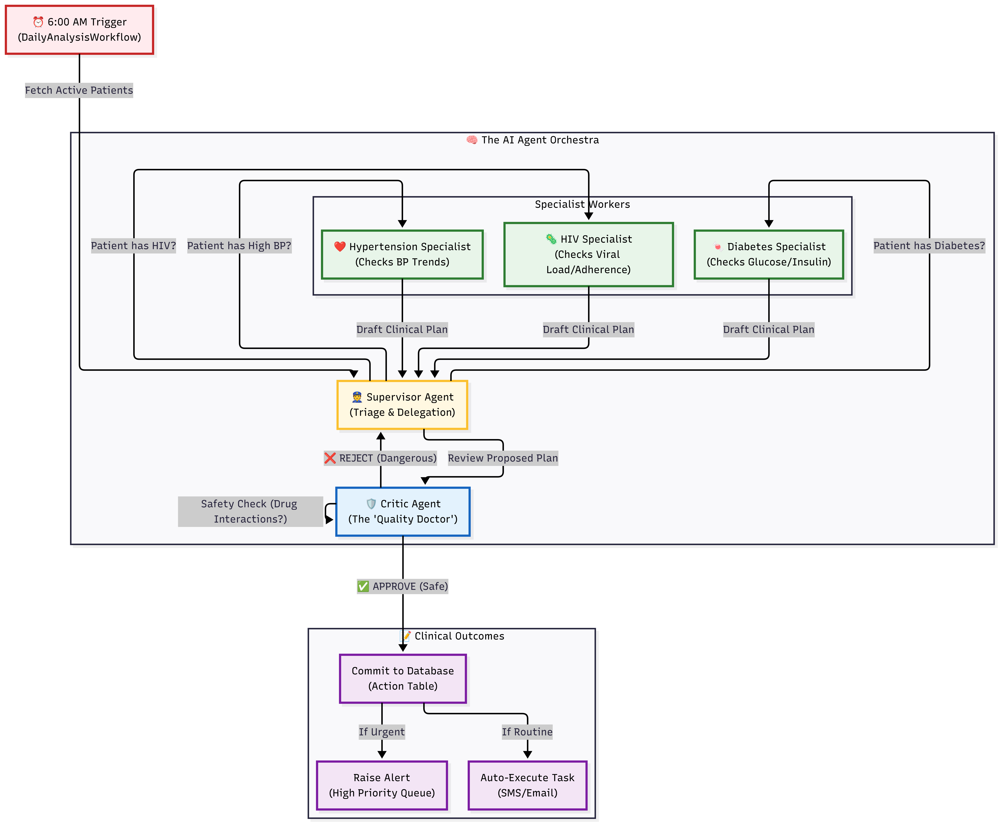
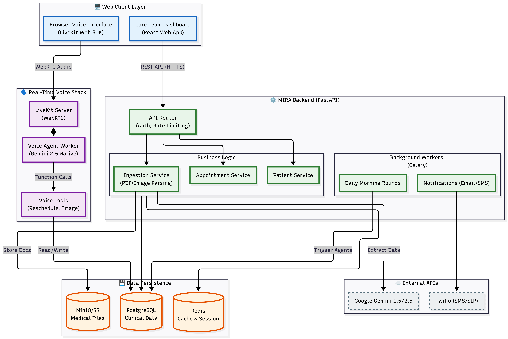

# Mira AI 🩺

Mira AI is an advanced healthcare provider assistant designed to empower medical teams in managing chronic conditions through a multi-agent AI architecture. By leveraging Large Language Models (LLMs) and clinical logic, Mira AI helps healthcare workers monitor patient health, manage treatment adherence, and coordinate interventions efficiently.

---

## 🧠 AI Agent Architecture

Mira uses a **T-MAC (Team Multi-Agent Collaboration)** architecture where specialized AI agents work together like a clinical team:



### How It Works

```
┌─────────────────────────────────────────────────────────────────────┐
│                     MORNING ROUNDS WORKFLOW                         │
├─────────────────────────────────────────────────────────────────────┤
│                                                                     │
│  1️⃣ LOAD DATA                                                       │
│     └── Fetch all active patients for the organization              │
│                                                                     │
│  2️⃣ SPECIALIST ANALYSIS (Parallel)                                  │
│     ├── 🔬 HIV Specialist    → Checks VL, adherence, regimen        │
│     ├── 💊 Hypertension      → Analyzes BP readings, medications    │
│     ├── 📊 Engagement        → Flags inactive patients              │
│     └── 📅 Follow-Up         → Schedules appointment reminders      │
│                                                                     │
│  3️⃣ SUPERVISOR SYNTHESIS                                            │
│     └── Head Doctor merges all recommendations, resolves conflicts  │
│                                                                     │
│  4️⃣ AUTO-EXECUTION                                                  │
│     └── Low-risk actions (reminders, nudges) sent automatically     │
│                                                                     │
│  5️⃣ CRITIC REVIEW                                                   │
│     └── Quality Doctor validates high-risk clinical decisions       │
│                                                                     │
│  6️⃣ PERSIST & COMPLETE                                              │
│     └── All actions saved with full decision trace for audit        │
│                                                                     │
└─────────────────────────────────────────────────────────────────────┘
```

### Agent Roles

| Agent | Role | Key Capabilities |
|-------|------|------------------|
| **Head Doctor** (Supervisor) | Orchestrates morning rounds | Coordinates specialists, synthesizes decisions, handles conflicts |
| **HIV Specialist** | ART management expert | VL monitoring, defaulter tracing, regimen optimization |
| **Engagement Specialist** | Patient activity monitor | Flags disengaged patients, sends onboarding reminders |
| **Follow-Up Specialist** | Appointment coordinator | Smart reminder scheduling based on no-show history |
| **Clinic Critic** | Quality control | Reviews AI decisions before execution |

---

## ⚡ Real-Time Thought Streaming

Watch the AI "think" in real-time! Mira streams each agent's reasoning process via Server-Sent Events (SSE):

```bash
# 1. Trigger analysis
curl -X POST "http://localhost:8000/api/v1/agents/trigger-rounds" \
  -H "Authorization: Bearer TOKEN"

# Response includes cycle_id
# {"data": {"cycle_id": "abc-123..."}}

# 2. Subscribe to thought stream
curl -N "http://localhost:8000/api/v1/agents/stream/abc-123" \
  -H "Authorization: Bearer TOKEN"
```

**Example Stream Output:**
```
🏥 Beginning morning rounds for organization...
📋 Loaded 15 active patients for analysis
🔬 Starting HIV review for 8 HIV patients...
⚠️ John Doe: VL=1500 copies/ml (UNSUPPRESSED). Requires urgent counseling.
✅ Jane Smith: VL<50 (UNDETECTABLE). Excellent response!
📊 HIV Review complete: 8 patients analyzed, 3 interventions proposed.
📝 Synthesis complete. 17 final actions decided.
⚡ Executing automated low-risk actions...
🔍 Critic reviewing all proposed actions for safety...
✅ Morning rounds complete. 17 actions ready.
```

---

## Key Features

### Multi-Tenancy & Security
- **Organization Management**: Built for hospitals, clinics, NGOs as distinct tenants
- **Role-Based Access Control (RBAC)**: Secure access for Doctors, Nurses, and Coordinators
- **Audit Logging**: Comprehensive tracking of all authentication and clinical events

### Clinical Management
- **Modular Condition Profiles**: Extensible architecture for disease-specific data
- **Automated Defaulter Tracing**: Flags patients who miss refills or appointments
- **Action Idempotency**: 48-hour cooldown prevents duplicate notifications
- **Decision Trace**: Full audit trail of AI reasoning for compliance

### Communication
- **Celery Background Workers**: Handles email delivery and periodic analysis
- **Email/SMS Notifications**: Automated patient reminders and nudges

---

## Tech Stack

| Category | Technology |
|----------|------------|
| **Framework** | [FastAPI](https://fastapi.tiangolo.com/) (Python 3.12+) |
| **Database** | [PostgreSQL](https://www.postgresql.org/) + [SQLAlchemy](https://www.sqlalchemy.org/) |
| **AI/LLM** | [Google Gemini](https://ai.google.dev/) |
| **Streaming** | [Redis Pub/Sub](https://redis.io/) + SSE |
| **Tasks** | [Celery](https://docs.celeryq.dev/) |
| **Infrastructure** | [Docker](https://www.docker.com/) |

### System Flow


---

## Getting Started

### Prerequisites
- Docker & Docker Compose
- Google Gemini API Key

### Installation

```bash
# 1. Clone the repository
git clone https://github.com/gemini-hack/backend.git
cd backend

# 2. Configure environment
cp .env.sample .env
# Edit .env with your GOOGLE_API_KEY, DATABASE_URL, REDIS_URL

# 3. Start the stack
docker compose up --build

# 4. Access the API
# API: http://localhost:8000/api/v1
# Docs: http://localhost:8000/docs
```

---

## 🏗 Project Structure

```text
├── alembic/              # Database migrations
├── app/
│   ├── agents/           # Multi-agent AI system
│   │   ├── supervisor.py # Head Doctor orchestration
│   │   ├── workers/      # Specialist agents (HIV, Engagement, etc.)
│   │   ├── context.py    # Shared agent state
│   │   └── thought_emitter.py  # Real-time streaming
│   ├── api/              # FastAPI routes
│   ├── models/           # SQLAlchemy models
│   ├── schemas/          # Pydantic validation
│   ├── services/         # Business logic
│   │   └── action_idempotency.py  # Duplicate prevention
│   └── workflows/        # Background workflows
├── docs/
│   └── images/           # Architecture diagrams
├── Dockerfile
└── compose.yml
```

---

## 📜 Contributing

To add a new disease specialization:

1. Create a profile model in `app/models/conditions.py`
2. Add a specialist agent in `app/agents/workers/`
3. Register the worker in `app/agents/factory.py`
4. Add thought emissions for real-time streaming

---

## ⚖️ License

Distributed under the MIT License. See `LICENSE` for more information.

