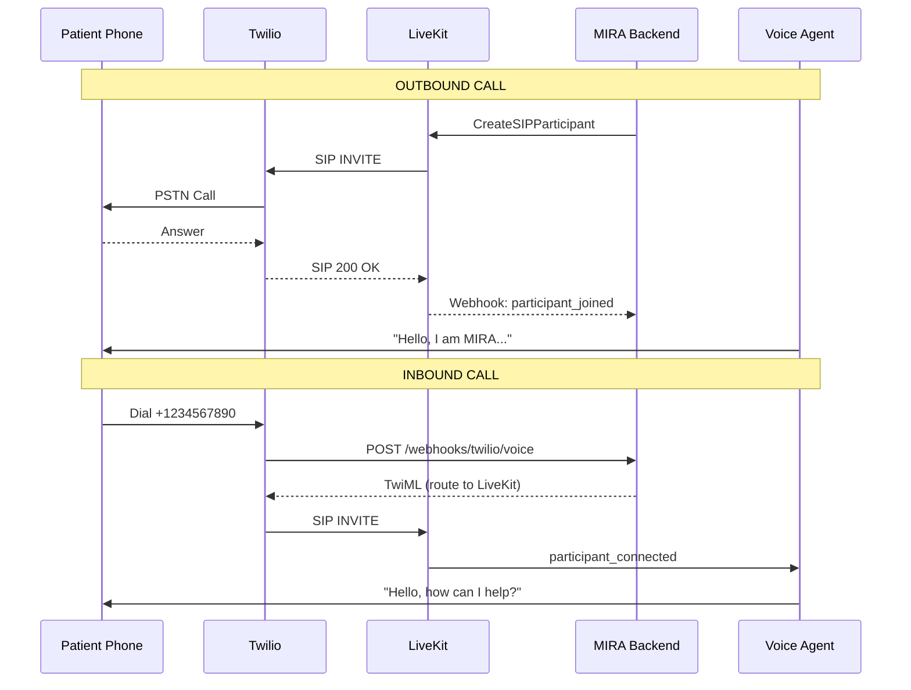

# Twilio + LiveKit SIP Setup Guide for MIRA AI

Complete guide for setting up bidirectional phone calls (outbound and inbound) with Twilio + LiveKit.

---

## Prerequisites

- [Twilio Account](https://www.twilio.com/try-twilio) with credit
- [LiveKit Cloud Account](https://cloud.livekit.io/)
- MIRA AI backend running
- [ngrok](https://ngrok.com/) (for local testing)

---

## Part 1: Twilio Configuration

### 1.1 Purchase a Phone Number

1. Log in to [Twilio Console](https://console.twilio.com/)
2. Navigate to **Phone Numbers** → **Manage** → **Buy a number**
3. Choose a number with **Voice** capability
4. Note: `TWILIO_PHONE_NUMBER=+1234567890`

### 1.2 Create SIP Trunk

1. Go to **Elastic SIP Trunking** → **Trunks** → **Create**
2. Name: `mira-ai-trunk`
3. Configure **Termination** tab:
   - SIP URI: `mira-ai-trunk.pstn.twilio.com`
   - Create credential list with username/password
4. Associate your phone number with the trunk

---

## Part 2: LiveKit Cloud Configuration

### 2.1 Create Outbound SIP Trunk

1. [LiveKit Cloud Dashboard](https://cloud.livekit.io/) → **Telephony** → **SIP Trunks**
2. Create **Outbound** trunk:

```json
{
  "name": "twilio-outbound",
  "address": "mira-ai-trunk.pstn.twilio.com",
  "transport": 1,
  "numbers": ["+1234567890"],
  "auth_username": "your_sip_user",
  "auth_password": "your_sip_password"
}
```

3. Copy the **Trunk ID** (e.g., `ST_xxxxx`) → `TWILIO_SIP_TRUNK_ID`

### 2.2 Create Inbound SIP Trunk (Optional)

For receiving calls from Twilio:

1. Create **Inbound** trunk in LiveKit
2. Note the LiveKit SIP URI (e.g., `sip:xxxxxx@livekit.cloud`)
3. Set as `LIVEKIT_SIP_URI` in your `.env`

---

## Part 3: Webhook Configuration

### 3.1 Expose Local Server (for testing)

```bash
# Start ngrok to expose your local server
ngrok http 8000
```

Note your ngrok URL (e.g., `https://abc123.ngrok.io`)

### 3.2 Configure Twilio Webhooks

1. **Phone Number Configuration**:
   - Go to Twilio Console → Phone Numbers → Your Number
   - **Voice & Fax** section:
     - **A CALL COMES IN**: Webhook → `https://your-ngrok.io/api/v1/webhooks/twilio/voice`
     - **STATUS CALLBACK URL**: `https://your-ngrok.io/api/v1/webhooks/twilio/status`

2. **SIP Domain Configuration** (for direct SIP routing):
   - Twilio Console → **SIP Domains**
   - Create domain or use existing
   - Set voice URL to your webhook

### 3.3 Configure LiveKit Webhooks

1. LiveKit Cloud Dashboard → **Settings** → **Webhooks**
2. Add webhook URL: `https://your-ngrok.io/api/v1/livekit/webhook`
3. Select events: `participant_joined`, `participant_left`, `room_finished`

---

## Part 4: Environment Configuration

```env
# LiveKit
LIVEKIT_URL=wss://your-project.livekit.cloud
LIVEKIT_API_KEY=your-api-key
LIVEKIT_API_SECRET=your-api-secret

# Enable SIP
LIVEKIT_SIP_ENABLED=true
LIVEKIT_SIP_URI=sip:your-trunk@livekit.cloud  # For inbound routing

# Twilio
TWILIO_ACCOUNT_SID=ACxxxxxxxxxxxxx
TWILIO_AUTH_TOKEN=your-auth-token
TWILIO_SIP_DOMAIN=mira-ai-trunk.pstn.twilio.com
TWILIO_PHONE_NUMBER=+1234567890
TWILIO_SIP_TRUNK_ID=ST_xxxxxxxxxxxxx
```

---

## Part 5: Testing

### 5.1 Check Service Status

```bash
curl -X GET http://localhost:8000/api/v1/calls/status \
  -H "Authorization: Bearer YOUR_JWT"
```

Expected:
```json
{"sip_enabled": true, "fully_configured": true, "from_number": "+1234567890"}
```

### 5.2 Test Outbound Call

**Prerequisites:**
- Patient with `preferred_contact_method = 'call'` and valid phone number
- Celery worker running

```bash
# Via API
curl -X POST http://localhost:8000/api/v1/calls/initiate \
  -H "Authorization: Bearer YOUR_JWT" \
  -H "Content-Type: application/json" \
  -d '{"patient_id": "patient-uuid", "call_type": "outbound_manual"}'

# Via Celery task directly
python -c "
from app.tasks.outbound_calls import trigger_patient_call
trigger_patient_call.delay('patient-uuid', 'outbound_manual')
"
```

### 5.3 Test Inbound Call

1. Call your Twilio number from a phone
2. Watch server logs for webhook activity:
   ```
   Inbound call: +1555... -> +1234..., CallSid: CA...
   ```
3. Call should route to LiveKit and MIRA agent

### 5.4 Test Webhooks Locally

```bash
# Test Twilio voice webhook
curl -X POST http://localhost:8000/api/v1/webhooks/twilio/voice \
  -d "From=+15551234567&To=+1234567890&CallSid=CAtest123&Direction=inbound"

# Test status callback
curl -X POST http://localhost:8000/api/v1/webhooks/twilio/status \
  -d "CallSid=CAtest123&CallStatus=completed&CallDuration=60"
```

### 5.5 End-to-End Test Checklist

| Test | Command/Action | Expected Result |
|------|----------------|-----------------|
| Service status | `GET /calls/status` | `fully_configured: true` |
| Outbound dial | `POST /calls/initiate` | Phone rings, agent connects |
| Inbound dial | Call Twilio number | MIRA answers, greets caller |
| Call status | Check CallSession in DB | Status updates as call progresses |
| Call end | Hang up | Session marked `COMPLETED` |

---

## Troubleshooting

| Issue | Solution |
|-------|----------|
| `SIP is not enabled` | Set `LIVEKIT_SIP_ENABLED=true` |
| No webhook received | Check ngrok is running, URL is correct in Twilio |
| 401 from Twilio | Verify SIP credentials match trunk config |
| Call fails immediately | Check Twilio trunk has phone number associated |
| No audio | Ensure G.711 codec support |
| Inbound not routing | Check `LIVEKIT_SIP_URI` and TwiML in voice webhook |

---

## Architecture



---

## API Endpoints

| Endpoint | Method | Purpose |
|----------|--------|---------|
| `/api/v1/calls/initiate` | POST | Initiate outbound call |
| `/api/v1/calls/sessions` | GET | List call history |
| `/api/v1/calls/sessions/{id}` | GET | Get call details |
| `/api/v1/calls/sessions/{room}/end` | POST | End active call |
| `/api/v1/webhooks/twilio/voice` | POST | Inbound call routing |
| `/api/v1/webhooks/twilio/status` | POST | Call status updates |
| `/api/v1/livekit/webhook` | POST | LiveKit room events |

---

## Reference Links

- [LiveKit SIP Documentation](https://docs.livekit.io/telephony/)
- [Twilio Elastic SIP Trunking](https://www.twilio.com/docs/sip-trunking)
- [ngrok Documentation](https://ngrok.com/docs/start)
